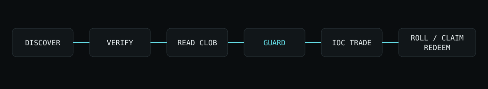

# WindowGuard

A final execution check for dreamDEX BTC five-minute Event Contracts on Somnia Shannon testnet.

Deployment: https://windowguard.samuelsuccess234.workers.dev

Deployment evidence is recorded in [`docs/DEPLOYMENT.md`](docs/DEPLOYMENT.md). A public demo video is still pending the funded transaction rehearsal.

## Problem

The price and available quantity can change while an order is reviewed. WindowGuard checks the current market generation, on-chain lifecycle, time remaining, fresh order book, and executable quantity before opening the wallet.

## Flow

Connect an injected EVM wallet on chain 50312, choose Up or Down, enter a quantity and maximum price per contract, and review the Guard result. The submit action repeats discovery, on-chain status, book, and limit checks before calling an IOC order. Actual fills come from confirmed receipt events.

The maximum applies to **every consumed price level**, not merely to the expected average. Depth-weighted average is shown for explanation. A partial or zero fill can still occur during wallet confirmation. IOC cancels the unfilled remainder.

## Architecture



`loadMarkets(true) → structured BTC/300s selection → getMarketOnchain → fetchOrderBook → Guard → createOrder(IOC) → receipt-event reconciliation`

WindowGuard uses real dreamDEX discovery, books, orders and settlement. It has no prediction model, database, new contract, or browser private key. Current markets are never hardcoded.

## Market rolls and claims

State is keyed by `marketId`. A generation change clears the book and review, and late old-generation requests are discarded. Wallet/account changes also invalidate the order. History is versioned, schema validated and namespaced by chain and wallet.

Claims scan the latest 120 locally recorded market IDs, not all venue history. Current lifecycle and both balances are read on-chain. Resolved markets offer only the winning nonzero balance; voided markets offer both nonzero balances separately. Redemption requires wallet approval and successful receipt plus post-transaction balance verification. Recovered collateral amounts are not guessed.

## Setup

Use Node **24.9.0** (`nvm use`). SDK **0.28.1** is pinned; `package-lock.json` pins dependencies.

```sh
npm ci
npm run dev
```

Public market reads require no wallet or environment file. Default public endpoints are in `.env.example`. For CLI transaction rehearsals, copy `.env.example` to `.env.local` and configure **disposable testnet-only** maker and taker keys locally. Never put keys in chat, source, video, or `NEXT_PUBLIC_` variables. Gas and tUSDC collateral are required for writes.

```sh
npm run doctor
npm run discover
npm run lint
npm run typecheck
npm test
npm run build
```

`doctor` asserts chain 50312; `discover` prints live market metadata and depth. No CLI writes run without an explicit `--execute` argument.

## Transaction rehearsal

```sh
npm run prepare-claim -- --execute
# Wait for resolution; read balances without writing:
npm run verify-claim
# Redeem only a genuinely payable balance:
npm run verify-claim -- --execute
```

`prepare-claim` buys 0.01 Up at a maximum 0.56 with 60 seconds headroom. `DEMO_MAXIMUM_PRICE` can deliberately change that boundary. It stores the result in ignored `market.json`. A losing position has no claim.

## Optional demo maker

```sh
npm run seed -- --execute
npm run cancel-demo -- --execute
```

The maker mints five sets and attempts post-only Up asks: two at 0.54 and three at 0.58. The live book may already cross those prices, causing a legitimate post-only rejection. It records order IDs immediately in ignored `.demo-orders.json`; cleanup cancels only those IDs for the maker wallet. Partial harness failures retain records for cleanup. Minted inventory remains in the maker wallet.

This separate test wallet supplies demonstration liquidity. WindowGuard does not create or guarantee liquidity. Existing organic depth can prevent the thin-book scenario; use a deliberately low limit to demonstrate a real block, or rehearse a suitable window.

## Evidence and limitations

See [spike results](docs/SPIKE_RESULTS.md), [SDK feedback](SDK_FEEDBACK.md), and [demo plan](DEMO.md).

- Real live discovery, books, blocked orders and market roll were observed in Chrome.
- 30 automated tests cover core protection and receipt reconciliation; build and typecheck pass.
- Funded browser order, rejection, on-chain fill, maker cleanup and redemption are still awaiting wallet rehearsal. No transaction evidence has been fabricated.
- The WebSocket can fail intermittently; stale books block trading.
- Browser wallet approval may outlast the market window. IOC protects price but cannot guarantee execution.
- No unobserved transaction is automatically retried. Check wallet history if a request returns an uncertain outcome.
- Claims cover recorded IDs only; finalized pagination is not implemented.

## Risk disclosure

Testnet prototype. Event Contracts can lose the full amount committed. WindowGuard checks execution conditions; it does not predict outcomes or guarantee fills. Not financial advice.

## Submission status

- [x] Real dynamic discovery and CLOB
- [x] Deterministic Guard and fresh pre-submit path
- [x] Real market rollover observed
- [x] Tests, typecheck and production build
- [ ] Funded IOC and reconciled real fill
- [ ] Real payable position and verified redemption
- [ ] Public 2–3 minute demo video
- [ ] Final deployed wallet rehearsal

Next: finish the funded lifecycle, record the video, and publish the submission evidence. Team: repository owner.
