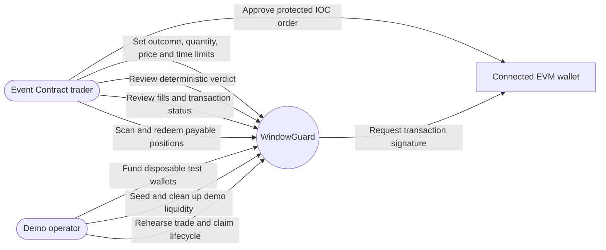
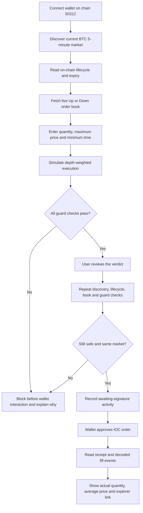
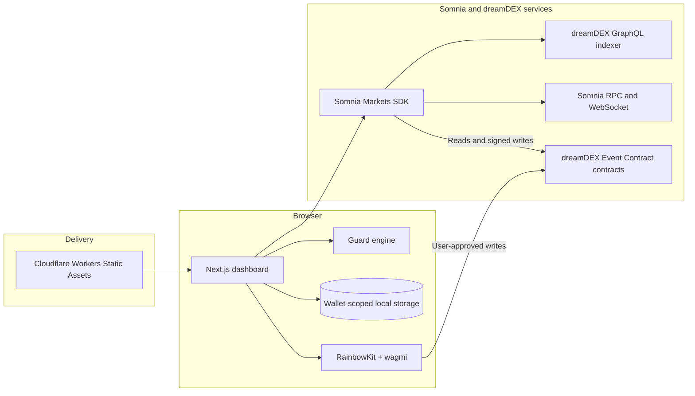

# WindowGuard

**A final execution check for dreamDEX BTC five-minute Event Contracts on Somnia Shannon testnet.**

[Live application](https://windowguard.samuelsuccess234.workers.dev/) · [Trading dashboard](https://windowguard.samuelsuccess234.workers.dev/dashboard) · [Architecture](architecture.md) · [Demo plan](DEMO.md)

WindowGuard protects the moment between reviewing an Event Contract order and signing it. It rechecks the active market, on-chain lifecycle, remaining time, live order-book freshness, available depth, and price limit immediately before opening the wallet. The order proceeds only when every condition still passes.

> Testnet prototype. Event Contracts can lose the full amount committed. WindowGuard checks execution conditions; it does not predict outcomes or guarantee fills.

## Why WindowGuard exists

Five-minute markets move quickly. A price that looked acceptable during review may no longer support the requested quantity when the user signs. The market can also roll into its next five-minute generation while an older preview is still visible.

WindowGuard turns the user’s limits into a deterministic execution policy:

- Trade only the currently active BTC five-minute market.
- Require the on-chain market state to remain `TRADING`.
- Reject stale or mismatched order-book snapshots.
- Require the complete quantity to be available within the maximum price.
- Require the user’s minimum time remaining.
- Re-run every check immediately before wallet approval.
- Submit an immediate-or-cancel order so no remainder rests unexpectedly.
- Report confirmed receipt fills instead of assuming the requested quantity executed.

WindowGuard is an execution-safety product, not a market predictor, trading signal, custody service, or liquidity guarantee.

## Use cases



## Golden-path flow



## What is implemented

- Dynamic discovery through `loadMarkets(true)` and structured BTC/300-second filtering.
- On-chain lifecycle and expiry verification through `getMarketOnchain()`.
- Live Up and Down CLOB depth with one-second refreshes.
- Depth-weighted fill estimation across multiple ask levels.
- Deterministic guard verdicts with user-readable reasons.
- RainbowKit wallet connection for injected wallets and optional WalletConnect QR/mobile support.
- Fresh pre-submit validation followed by a limit buy with `timeInForce: "IOC"`.
- Receipt-event reconciliation for confirmed, partial, zero-fill, and reverted results.
- Market-generation roll detection that clears stale books and review approval.
- Wallet-scoped, schema-validated local activity history.
- Activity recovery from dreamDEX indexed orders and fills when the indexer is available.
- Resolved and voided position discovery with verified redemption.
- Disposable test-wallet scripts for funding, liquidity, trade, and claim rehearsals.
- Responsive landing page and dashboard deployed as static assets on Cloudflare Workers.

## Guard decisions

| Decision | Trigger | Result |
|---|---|---|
| `SAFE` | The current market, lifecycle, time, book, depth, and price all pass | Review and submission can proceed |
| `INVALID_INTENT` | Quantity, price, or time falls outside supported bounds | Block |
| `WINDOW_ROLLED` | The intent or book belongs to an older `marketId` | Clear the preview and block |
| `MARKET_NOT_TRADING` | On-chain lifecycle is not `TRADING` | Block |
| `WINDOW_CLOSING` | Remaining time is below the user’s minimum | Block |
| `STALE_BOOK` | The snapshot is mismatched, future-dated, or older than 2.5 seconds | Block |
| `INSUFFICIENT_DEPTH` | The full quantity is unavailable within the limit | Block |
| `PRICE_MOVED` | Expected or worst consumed price exceeds the maximum | Block |

The maximum price applies to every consumed order-book level, not only the displayed average.

## Architecture at a glance



See [architecture.md](architecture.md) for component boundaries, sequence diagrams, state handling, failure modes, and security decisions.

## Technology

| Layer | Technology |
|---|---|
| Frontend | Next.js 15, React 19, TypeScript |
| Wallet | RainbowKit, wagmi, viem |
| Markets | `@somnia-chain/markets-sdk` 0.28.1 |
| Validation | Zod |
| Tests | Vitest |
| Network | Somnia Shannon testnet, chain ID `50312` |
| Hosting | Cloudflare Workers Static Assets |
| Persistence | Browser `localStorage`, namespaced by chain and wallet |

## Run locally

### Prerequisites

- Node.js `>=20.11` (the verified environment used Node `24.9.0`)
- npm
- An injected EVM wallet for browser writes
- Disposable Shannon testnet wallets only for CLI rehearsals

### Installation

```sh
git clone https://github.com/mrfomoweb3/windowguard.git
cd windowguard
npm ci
cp .env.example .env.local
npm run dev
```

Open `http://localhost:3000`. Public market reads work with the default endpoints and do not require a wallet.

### Environment variables

| Variable | Purpose | Exposure |
|---|---|---|
| `NEXT_PUBLIC_SOMNIA_CHAIN_ID` | Documents the expected network; runtime is pinned to `50312` | Public |
| `NEXT_PUBLIC_SOMNIA_RPC_URL` | Somnia HTTP RPC | Public |
| `NEXT_PUBLIC_SOMNIA_WS_RPC_URL` | Somnia WebSocket RPC | Public |
| `NEXT_PUBLIC_DREAMDEX_WS_URL` | Reference dreamDEX public WebSocket endpoint; the current client uses the Somnia SDK transport | Public |
| `NEXT_PUBLIC_DREAMDEX_INDEXER_URL` | dreamDEX GraphQL indexer | Public |
| `NEXT_PUBLIC_APP_ENV` | Labels the build as testnet | Public |
| `NEXT_PUBLIC_WALLETCONNECT_PROJECT_ID` | Enables QR and mobile wallet connections | Public client identifier |
| `DEMO_MAKER_PRIVATE_KEY` | Disposable CLI maker wallet | Server-side CLI only |
| `DEMO_TAKER_PRIVATE_KEY` | Disposable CLI taker wallet | Server-side CLI only |

Never prefix a private key with `NEXT_PUBLIC_`. Never reuse a personal or mainnet wallet key.

## Verify the project

```sh
npm run doctor
npm run discover
npm run lint
npm run typecheck
npm test
npm run build
```

- `doctor` verifies chain `50312`, endpoint configuration, and whether CLI keys exist without printing them.
- `discover` prints the live BTC five-minute market and current depth.
- The current suite contains **34 automated tests** across guard safety, fill simulation, market rolls, receipt reconciliation, claims, and activity recovery.
- CLI commands that write to the testnet require an explicit `--execute` argument.

## Testnet rehearsals

### Protected IOC and claim check

```sh
npm run prepare-claim -- --execute
npm run verify-claim
npm run verify-claim -- --execute
```

`prepare-claim` submits a `0.01` Up IOC under the configured maximum and stores its non-secret record in ignored `market.json`. Run the final command only when the read-only claim check reports a payable position.

### Optional demo liquidity

```sh
npm run seed -- --execute
npm run cancel-demo -- --execute
```

The maker script supplies test liquidity and records only its own order IDs for cleanup. WindowGuard does not create or guarantee organic liquidity.

## Verifiable testnet evidence

- [Protected IOC `0x0d52…850b`](https://shannon-explorer.somnia.network/tx/0x0d5269c66870fb2609b0f44fac12a9c31365582092152a389d5a311a0848850b): requested and filled `0.01` Up at `0.536` average under a `0.56` maximum.
- [Protected IOC `0x9892…6b61`](https://shannon-explorer.somnia.network/tx/0x9892c5460eadc7aadf0b3d5ca4763fecdda6a9026c8e62823231c6e8220b6b61): requested and filled `0.01` Up at `0.804` average under a `0.99` maximum.
- [Complete-set mint `0x8ea1…1631`](https://shannon-explorer.somnia.network/tx/0x8ea11666df3ec0c1d64c8580b606d95b938f0d3f2ccce687151fe2501f8c1631).
- [Resolved-position redemption `0x37a8…0b22`](https://shannon-explorer.somnia.network/tx/0x37a82ed068c2abb6e0f2960a6cbfc52bfa4fdddb0ad898c6b7fca26d9e870b22): WindowGuard selected the winning outcome from on-chain state and verified its balance became zero after confirmation.

More evidence is recorded in [docs/SPIKE_RESULTS.md](docs/SPIKE_RESULTS.md) and [docs/DEPLOYMENT.md](docs/DEPLOYMENT.md).

## Failure behavior and limitations

- WebSocket or RPC failures never enable submission. Stale data produces a blocking verdict.
- Indexer failures do not remove locally confirmed activity. Recovery retries in the background.
- Wallet approval can outlast the market window. WindowGuard rechecks before opening the wallet, but it cannot control approval latency afterward.
- IOC protects against an unwanted resting remainder but cannot guarantee a fill.
- No uncertain transaction is automatically retried. Users should inspect wallet history before retrying.
- Claim scanning covers the latest 120 recorded market IDs; full historical pagination is not implemented.
- The application is testnet-only and does not include a custom smart contract or backend database.

## Repository guide

```text
app/                         Routes, providers, and presentation
components/                  Trading dashboard and wallet interaction
lib/                         Market, guard, trade, claim, and persistence logic
scripts/                     Read-only diagnostics and explicit testnet write tools
tests/                       Deterministic unit and regression tests
docs/                        Deployment and feasibility evidence
architecture.md              Detailed system architecture and diagrams
DEMO.md                      Two-to-three-minute demonstration sequence
SDK_FEEDBACK.md              Verified SDK behavior and integration feedback
```

## Documentation

- [System architecture](architecture.md)
- [Deployment evidence](docs/DEPLOYMENT.md)
- [Feasibility spike and transaction evidence](docs/SPIKE_RESULTS.md)
- [Demo plan](DEMO.md)
- [SDK integration notes](SDK_FEEDBACK.md)

## Hackathon status

- [x] Dynamic current-market discovery and live CLOB
- [x] Deterministic guard and fresh pre-submit validation
- [x] Real market-roll handling
- [x] RainbowKit wallet integration
- [x] Real protected IOC and receipt-event reconciliation
- [x] Activity persistence and indexed recovery
- [x] Resolved-position discovery and verified redemption
- [x] Automated tests, production build, and Cloudflare deployment
- [ ] Public two-to-three-minute demo video
- [ ] Final submission form

## License

No license has been added yet. All rights remain with the repository owner until a license is chosen.
