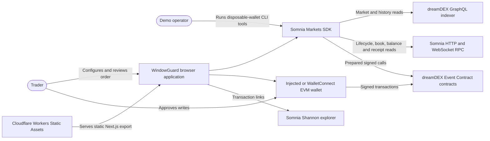
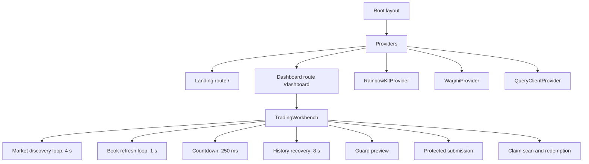
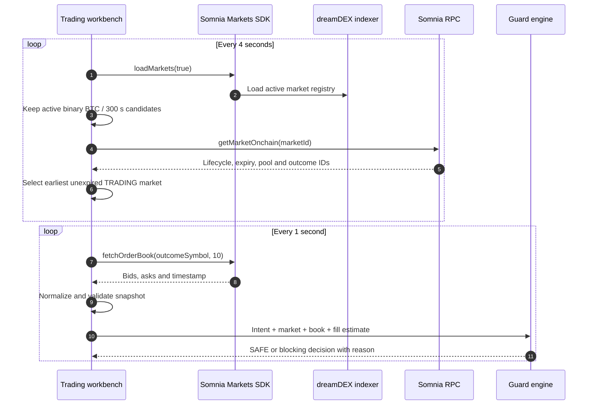
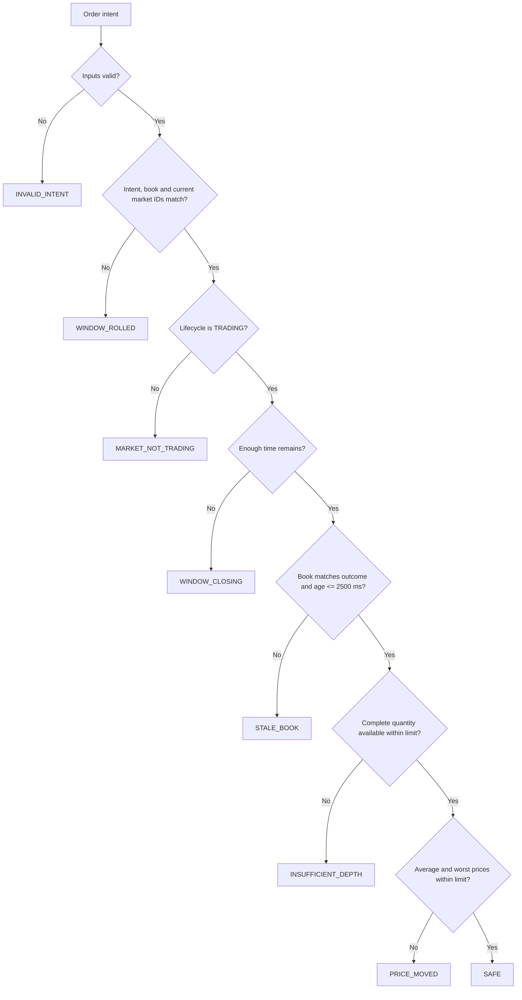
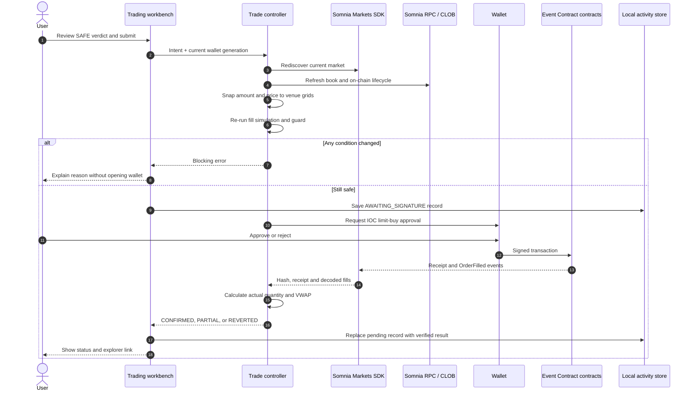
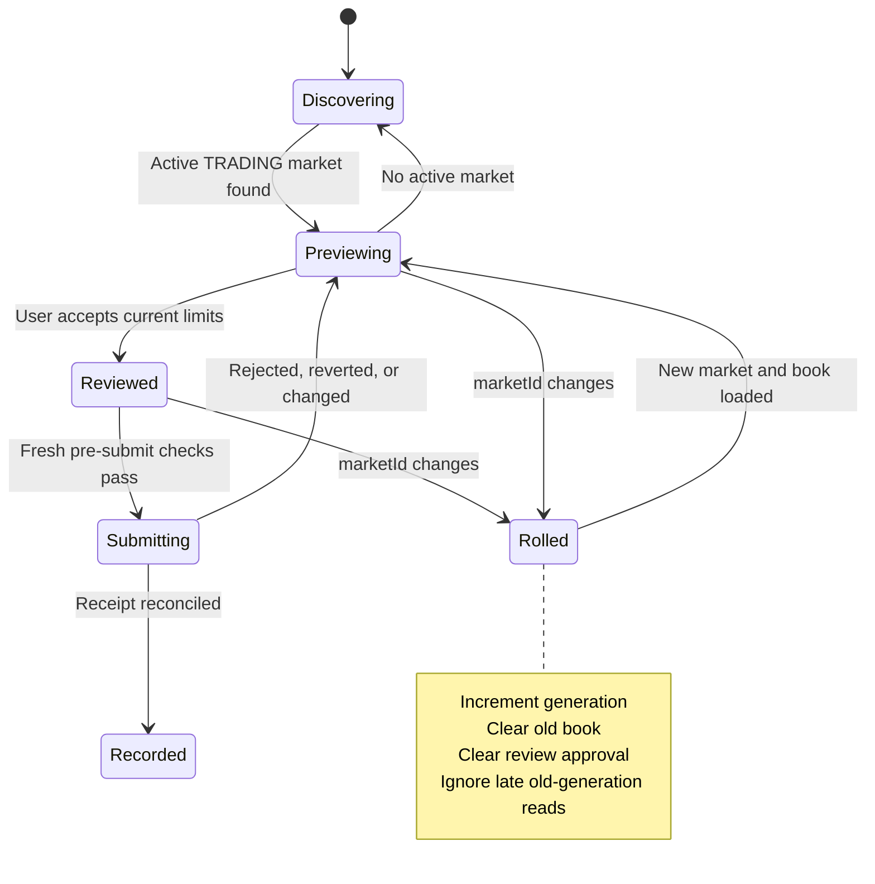
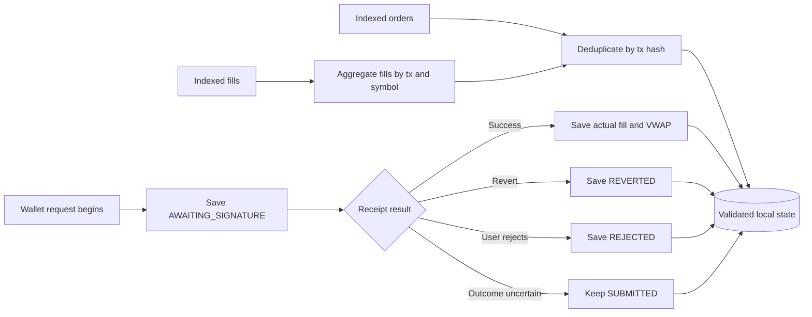
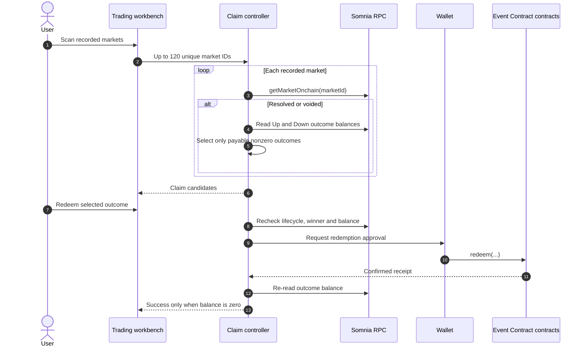
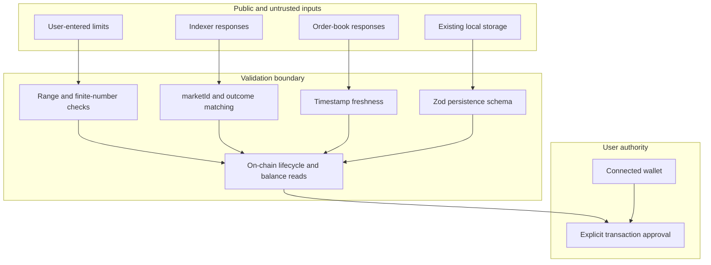
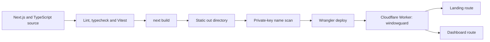

# WindowGuard architecture

This document describes the implemented WindowGuard MVP: a browser-based execution guard for dreamDEX BTC five-minute Event Contracts on Somnia Shannon testnet.

## 1. System goals

WindowGuard must answer one question immediately before a wallet transaction: **does this complete order still satisfy the user’s stated execution limits on the current market?**

The architecture prioritizes these invariants:

1. A preview belongs to one exact `marketId` generation.
2. A write is allowed only while the on-chain lifecycle is `TRADING`.
3. The order book must describe the selected outcome and be no older than 2.5 seconds.
4. The entire requested quantity must be available at prices no higher than the user’s maximum.
5. The user’s minimum remaining-time requirement must still pass.
6. Every check runs again immediately before wallet interaction.
7. Reported execution comes from the confirmed receipt and decoded fills, not the requested amount.
8. A claim is offered only when current on-chain state and token balances prove it is payable.

## 2. Scope and boundaries

### In scope

- Somnia Shannon testnet, chain ID `50312`
- BTC five-minute binary Event Contracts
- Up and Down buy intents
- Live CLOB inspection and deterministic execution checks
- User-approved IOC orders
- Receipt and indexed-history reconciliation
- Recorded-market claim discovery and redemption
- Browser-local non-secret persistence
- Static Cloudflare deployment

### Out of scope

- Price prediction or trading recommendations
- Custody, session keys, or unattended trading
- Mainnet and multi-chain execution
- Custom smart contracts
- Backend database or user accounts
- Guaranteed liquidity, fill, profit, or outcome
- Full venue-wide historical portfolio indexing

## 3. System context



## 4. Runtime components

| Component | Responsibility | Primary implementation |
|---|---|---|
| Landing page | Explains the problem and routes users to the workbench | `app/page.tsx`, `app/landing.module.css` |
| Provider layer | Configures RainbowKit, wagmi, viem transport, and React Query | `app/providers.tsx` |
| Trading workbench | Orchestrates polling, wallet state, previews, submissions, history, and claims | `components/trading-workbench.tsx` |
| SDK adapter | Creates a configured `SomniaMarkets` instance | `lib/exchange.ts` |
| Market discovery | Selects the current active BTC/300-second binary market and verifies it on-chain | `lib/market-discovery.ts` |
| Live book adapter | Reads and normalizes Up or Down depth | `lib/live-book.ts`, `lib/book-controller.ts` |
| Fill simulator | Walks asks up to the user’s maximum and calculates quantity, cost, VWAP, and worst price | `lib/fill-simulation.ts` |
| Guard engine | Produces deterministic allow/block decisions | `lib/guard-engine.ts` |
| Trade controller | Revalidates, submits IOC, and reconciles receipt fills | `lib/trade-controller.ts` |
| Claim controller | Proves payable outcomes, redeems, and verifies the post-write balance | `lib/claim-controller.ts` |
| Persistence | Validates wallet-local state and merges indexed orders and fills | `lib/persistence.ts` |
| CLI harness | Funds disposable wallets and rehearses liquidity, trades, and claims | `scripts/` |
| Static delivery | Publishes the exported `out/` directory | `next.config.ts`, `wrangler.jsonc` |

## 5. Frontend composition



The MVP intentionally keeps orchestration in one client component. Domain decisions remain in pure or narrowly scoped `lib/` modules, which makes the safety rules independently testable.

## 6. Market discovery and preview flow



The current market is never hardcoded. Structured `asset` and `intervalSec` fields select BTC five-minute markets. `marketId`, not pool address, identifies a generation because pools can be reused across windows.

## 7. Guard pipeline

The guard evaluates checks in a fail-closed order:



The order of checks makes each verdict reproducible and ensures malformed or stale data cannot accidentally fall through to `SAFE`.

### Fill simulation

For a requested quantity `Q`, the simulator sorts valid ask levels by ascending price and consumes each level while `price <= maximumPrice`:

```text
take_i = min(remainingQuantity, levelQuantity_i)
totalCost = Σ(take_i × levelPrice_i)
averagePrice = totalCost / filledQuantity
```

The order passes only when `filledQuantity` equals `Q`. It also checks the worst consumed level, preventing a favorable average from hiding a price above the user’s limit.

## 8. Protected order sequence



The controller never silently rounds quantity upward. It rejects a quantity that does not exactly match the lot grid. A buy limit is snapped conservatively so the represented price cannot exceed the user’s maximum.

## 9. Market-roll state machine



The component maintains a generation counter. Market rolls, wallet changes, and reconnects invalidate pending reads. A late response can update the screen only if its generation and `marketId` still match.

## 10. Activity persistence and recovery

Activity has two complementary sources:

1. **Immediate local state:** before the wallet opens, the app saves an `AWAITING_SIGNATURE` record. A successful receipt replaces it with the verified result. A wallet rejection becomes `REJECTED`; an uncertain post-broadcast error remains `SUBMITTED` rather than disappearing.
2. **Indexed recovery:** every eight seconds, the app independently requests recent wallet orders and fills. Successful results merge into local state by transaction hash. One failed index source does not block the other.



Storage keys use `windowguard:50312:<lowercase-wallet>`. Zod validates version `1`, market IDs, transaction hashes, numeric fields, and status values before data enters the UI. The browser stores no private key.

## 11. Claim discovery and redemption



Resolved markets expose only the winning nonzero outcome. Voided markets can expose both nonzero outcomes separately. A successful zero-payout call is not treated as evidence that a losing outcome was claimable.

## 12. Data model

The central domain types live in `lib/types.ts`.

| Type | Key fields | Purpose |
|---|---|---|
| `TrackedMarket` | `marketId`, outcome symbols, pool, token IDs, expiry, lifecycle | Immutable identity plus current on-chain wiring |
| `BookSnapshot` | `marketId`, outcome, timestamp, bids, asks | Generation-bound executable depth |
| `OrderIntent` | outcome, quantity, maximum price, minimum time | User-defined execution policy |
| `FillEstimate` | fillable quantity, cost, average, worst price | Deterministic simulated execution |
| `GuardDecision` | code, allowed, reasons, evaluated inputs | Auditable guard output |
| `TradeRecord` | transaction hash, requested and filled quantity, prices, status | Activity and reconciliation record |
| `ClaimCandidate` | lifecycle, winner, balances, payable outcomes | Verified redemption input |

No private key, signature, raw wallet export, or authentication secret is part of these models.

## 13. Trust and security boundaries



### Security decisions

- Browser writes use the connected wallet. Private keys never enter the frontend bundle.
- CLI keys are disposable testnet-only secrets in ignored `.env.local` variables.
- All critical write conditions are recalculated immediately before `createOrder()` or `redeem()`.
- Invalid, stale, missing, or mismatched data blocks action.
- Receipt status controls success reporting.
- Indexed data can recover history but cannot authorize a trade or redemption.
- No uncertain transaction is automatically retried, preventing accidental duplicate orders.
- Static hosting removes application-server session and database attack surfaces, but RPC, indexer, wallet, dependency, and client-integrity risks remain.

## 14. Failure modes

| Failure | Detection | Behavior |
|---|---|---|
| No active BTC five-minute market | Discovery returns `null` | Keep polling; submission stays disabled |
| RPC or WebSocket interruption | SDK call rejects or snapshot ages out | Show reconnect path and fail closed |
| Indexer unavailable | History request rejects | Preserve local activity and retry later |
| Market rolls during review | Current `marketId` differs | Clear book and approval; require a new review |
| Wallet or chain changes | Account generation changes | Remove signer, clear claims and invalidate submission |
| User rejects wallet request | Rejection error | Mark activity `REJECTED` |
| Broadcast outcome is uncertain | No verifiable receipt result | Keep `SUBMITTED`, show warning, never retry automatically |
| Transaction reverts | Receipt status is not successful | Mark `REVERTED`; report no fill |
| Partial execution | Decoded fills total less than request | Mark `PARTIAL`; report actual quantity and VWAP |
| Claim becomes invalid | Pre-redemption recheck fails | Block redemption and request refresh |
| Post-redemption balance remains | Balance is nonzero after receipt | Report that verification needs review |
| Browser storage unavailable | `localStorage` write throws | Persistence fails closed; the browser does not accept malformed or unsaved activity as verified history |

## 15. Deployment architecture



`next.config.ts` enables static export and unoptimized images. `wrangler.jsonc` serves `./out` through Cloudflare Workers Static Assets and falls back to the single-page application handler for unknown paths.

Production: [windowguard.samuelsuccess234.workers.dev](https://windowguard.samuelsuccess234.workers.dev/)

## 16. Verification strategy

The test suite covers:

- Multi-level fill estimation and invalid depth filtering
- Guard decision ordering and fail-closed behavior
- Stale, wrong-outcome, future-dated, and rolled books
- Fresh pre-submit checks and wallet-generation changes
- IOC configuration, zero fills, partial fills, and reverted receipts
- Claimable outcome selection for resolved and voided markets
- Indexed order and fill recovery with transaction deduplication

The current suite contains 34 tests. Real Shannon evidence includes successful IOC fills, complete-set minting, resolved-position selection, and post-redemption balance verification. See [docs/SPIKE_RESULTS.md](docs/SPIKE_RESULTS.md).

## 17. Architectural trade-offs

### Static client instead of an application backend

This keeps the MVP transparent and non-custodial. It also means availability depends directly on the user’s RPC, indexer, and wallet connections. There is no server-side retry queue or shared account history.

### Local persistence plus indexed recovery

Local storage gives immediate activity without waiting for indexer finality. Indexed recovery restores fills across reloads when the service is available. The compromise is eventual rather than guaranteed complete history.

### IOC-only execution

IOC prevents an unfilled remainder from resting after the user’s review window. It does not guarantee full execution because book state can change during wallet approval.

### Recorded-ID claim scanning

Scanning recorded IDs avoids relying on incomplete finalized-market discovery. It keeps the MVP bounded to 120 markets but does not provide a complete historical portfolio.

### One orchestration component

Centralized orchestration reduced integration risk during the hackathon. If the product grows, wallet readiness, discovery, activity, and claims should move into dedicated hooks or state machines while preserving the tested domain modules.

## 18. Next architectural steps

1. Add a dedicated historical index with pagination and health monitoring.
2. Add browser-level tests for wallet rejection, delayed approval, market roll, and activity recovery.
3. Add explicit RPC failover and measured retry/backoff policies.
4. Split workbench orchestration into focused hooks after golden-path behavior is locked.
5. Add mainnet configuration only after a separate security, economic, and operational review.
